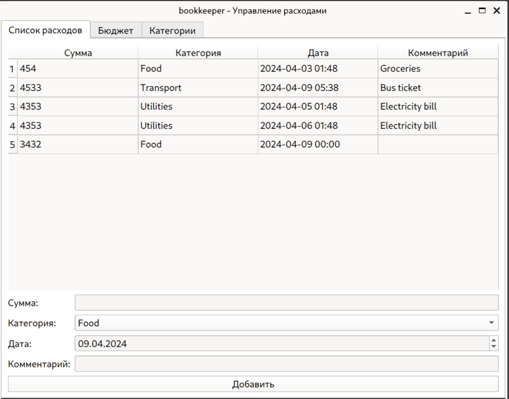

[Техническое задание](specification.md)

[Описание задания](project_desc.md)



### Зависимости

Для корректной работы необходимо установить следующие зависимости:

- poetry

### Инструкция по запуску

```bash
poetry shell
poetry install
poetry run start
```

### Структура проекта

Проект реализован согласно паттерну MVC + (Service and Repository layers).

Для удобства вынес всю логику в Service Layer

```bash
bookkeeper/          # Корневая директория проекта
│
├── config/          # Модули для конфигурации приложения
│
├── controllers/     # Контроллеры (обработчики запросов)
│
├── models/          # Модели данных (классы для работы с данными)
│
├── repository/      # Репозитории (абстракции для работы с базой данных)
│
├── scripts/         # Полезные скрипты и утилиты
│
├── services/        # Сервисы (логика бизнес-приложения)
│
├── utils/           # Утилиты и вспомогательные функции
│
└── views/           # Представления (шаблоны для отображения данных)
│
tests/               # Директория с модулями тестов

```

### На доработку:

1. Необходимо переработать валидацию и обработку ошибок в приложении. В текущей реализации используется временное решение
2. Необходимо покрыть тестами controllers и view. На данный момент тестами покрыты: services, models, repository и некоторые utils
3. В коде (в services, controllers) можно встретить инициализацию перменных таким способом. Возможно не самое лучшее решение, но использовалось осознано. 
Данная реализация позволяет не импортировать дополнительно repo в те места, где используется service, что сильно упрощает замену репозитория на другой. Также передача параметра через конструктор класса позволяет использовать другой набор параметров (Например, при тестировании).

```python
class BudgetService:
    def __init__(self, repo: AbstractRepository[Budget] = None) -> None:
        **self.repo = repo or SQLiteRepository[Budget](Budget)**
```